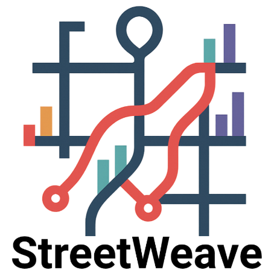

# StreetWeave: A Declarative Grammar for Street-Overlaid Visualization of Multivariate Data

 

<!-- *A structured, machine-readable knowledge base of components and dependencies found in Visual Analytics (VA) systems, derived systematically from research literature.* -->

---

**Main page:** [https://urbantk.org/streetweave/](https://urbantk.org/streetweave/) 

---
## Overview 

StreetWeave is a declarative grammar that helps users create custom, street-overlaid visualizations of multivariate spatial network data at multiple resolutions. Designed for urban planners, climate researchers, health experts, it removes technical barriers by simplifying the integration of thematic data (like demographics or pollution) with physical data (like street networks) across varying spatial and temporal scales. Based on a review of 45 prior studies, StreetWeave provides a flexible design space that supports rich, domain-specific exploration and analysis without requiring programming expertise.

## Key features
 - Structured design space for street-overlaid visualization.
 - Easy integration of physical and thematic data layers.
 - StreetWeave grammar with JSON spec and schema validation.
 - Rapid prototyping of street-overlaid visualizations.
 - Reproducibility via shareable JSON specifications.
 - Extensibility by integrating Vega-Lite to embed new encodings without changing the core architecture.

## StreetWeave quick start guide 

Follow these steps to run the StreetWeave project on your local machine:

1. **Download the project code.**  
   Clone the repository or download the project ZIP and extract it to your computer.

2. **Install Node.js and npm** (if you haven’t already).  
   StreetWeave requires Node.js and npm (or another package manager like Yarn, pnpm, or Bun). You can download Node.js and npm from: https://nodejs.org/en/download

3. **Navigate to the project directory.**  
   Open your terminal or command prompt and change the directory to the project folder.

4. **Install dependencies in the streetweave folder.**  
   In the project root, navigate to the `streetweave` folder and run the following command to install all necessary packages:

   `npm install`

   `npm run build`

5. **Install dependencies in the editor folder.**  
   In the project root, navigate to the `editor` folder and run the following command to install all necessary packages:

   `npm install`

6. **Start the development server.**  
   In the `editor` folder, run the following command to start the Vite development server:
   
   `npm run dev`

7. **Access the app in the browser.**  
   After the server starts, it will display a local URL: http://localhost:5173/

## StreetWeave Examples
A set of examples can be found [here](docs/).

## Team 

*   **[Sanjana Srabanti](https://sanjanasrabanti16.github.io/)** (UIC) 
*   **G. Elisabeta Marai** (UIC) 
*   **[Fabio Miranda](https://fmiranda.me/)** (UIC) 

   
  

